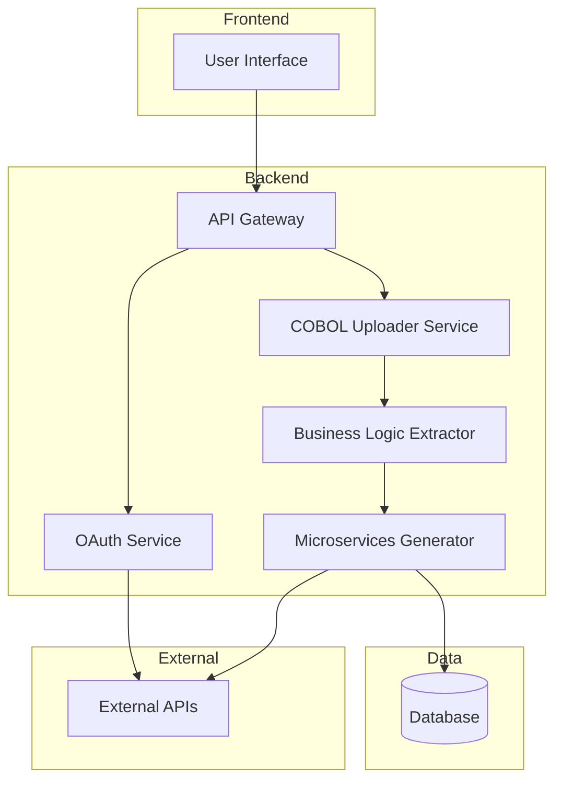

Here's a markdown file with a Mermaid.js flowchart representing a component diagram for the CobalToJava project. The diagram is organized into layers (Frontend, Backend, Data, External) with relationships and dependencies:

```markdown

```

### Explanation:
- **Frontend Layer**: Contains the User Interface (UI) component that interacts with the user.
- **Backend Layer**: 
  - **API Gateway (APIG)**: Serves as the entry point for the frontend and manages routing to backend services.
  - **OAuth Service (Auth)**: Handles authentication and authorization.
  - **COBOL Uploader Service**: Responsible for uploading COBOL programs.
  - **Business Logic Extractor**: Extracts business logic, validations, and external API calls from uploaded COBOL programs.
  - **Microservices Generator**: Creates new microservices in Java Spring Boot based on extracted information.
- **Data Layer**: 
  - **Database (DB)**: Stores extracted information and generated microservices data.
- **External Layer**:
  - **External APIs**: Represents any external APIs that might be interacted with during the extraction or execution process.

The arrows represent the flow of data and dependencies between the components.