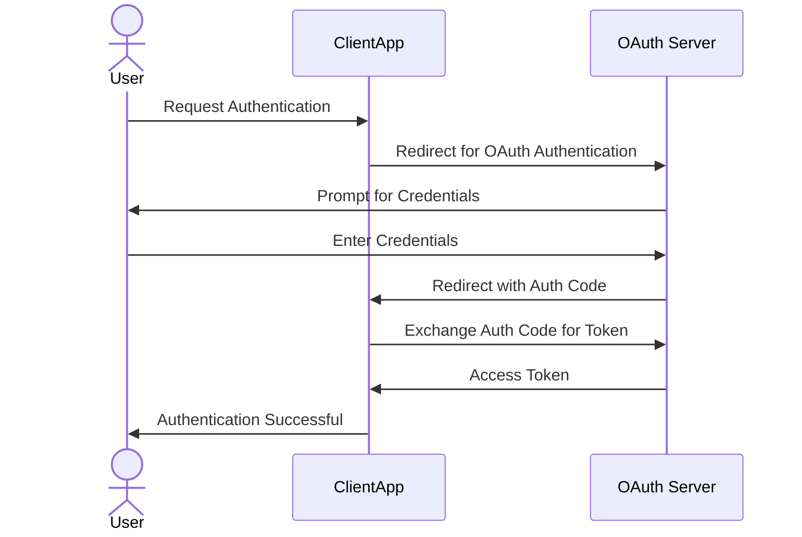
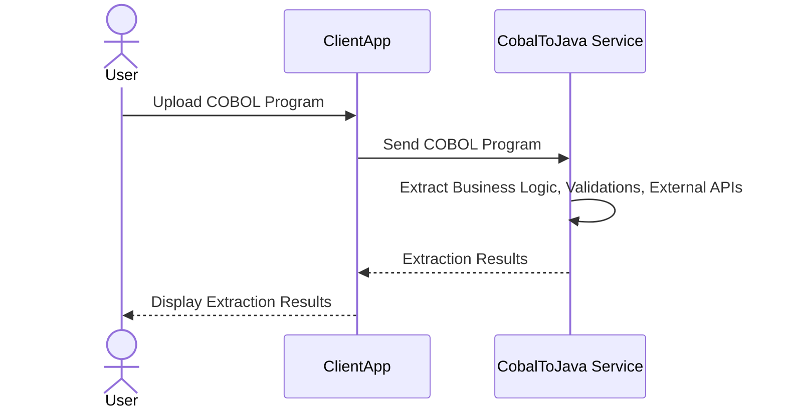
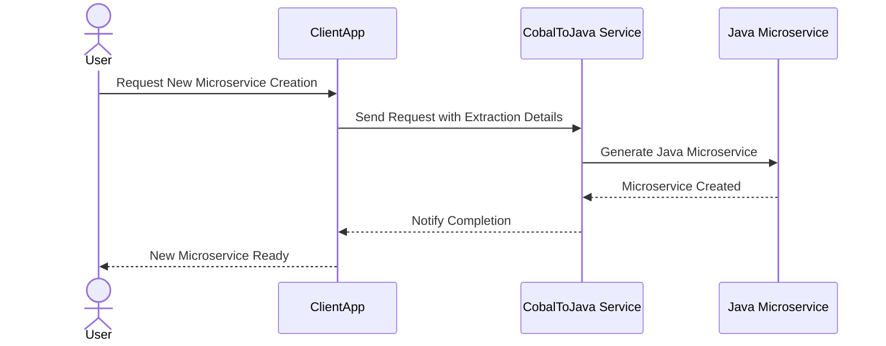
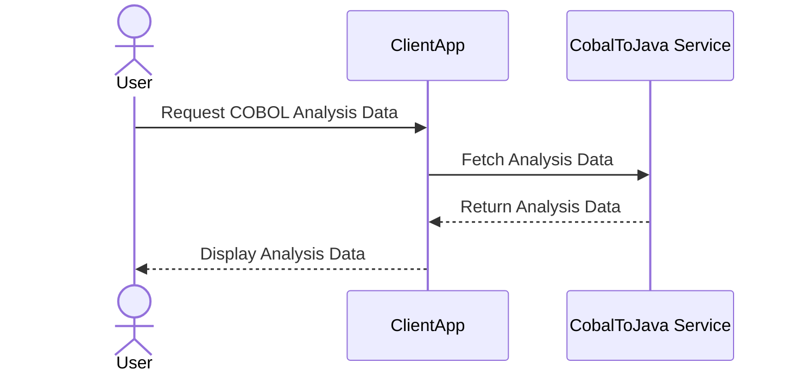
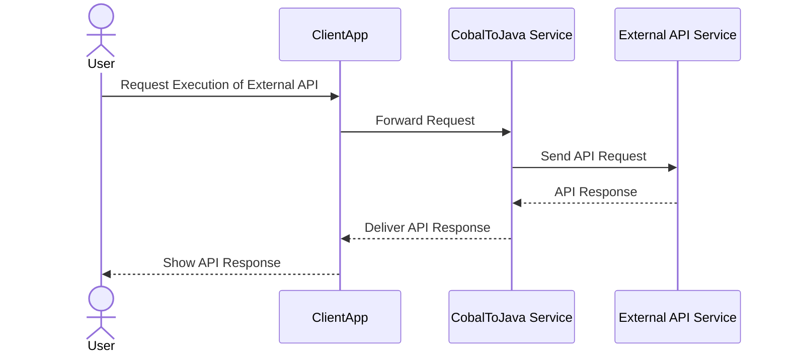

Certainly! Below is a Markdown file with Mermaid.js sequence diagrams illustrating key user flows for the "CobalToJava" project. Each sequence diagram captures a different aspect of the system, including authentication, data operations, and main features.

```markdown
# CobalToJava Sequence Diagrams

## 1. User Authentication Flow


## 2. COBOL Program Upload and Processing


## 3. Create New Microservices in Java Spring Boot


## 4. Data Operation - Fetch COBOL Analysis


## 5. Integration with External APIs


```

These diagrams collectively demonstrate the key functionalities and user interactions within the CobalToJava system. They cover essential operations such as authentication, COBOL program uploading, Java microservice creation, data retrieval, and external API integration.