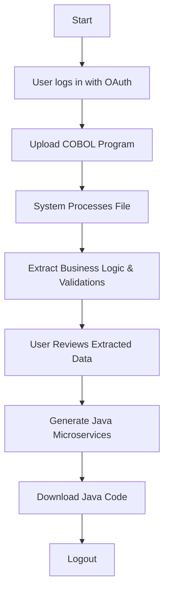
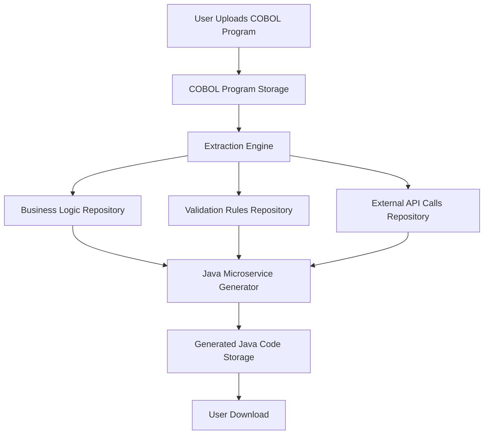

# CobalToJava System Flow Documentation

## 1. User Workflows

### Overview
Users will interact with the CobalToJava system through a web-based interface that communicates with backend microservices. The primary actions users can perform include uploading COBOL programs, reviewing extracted business logic, and generating Java microservices.

### User Journey

- **Login**: Users will authenticate using OAuth to ensure secure access.
- **Upload**: Users upload COBOL programs for analysis.
- **Review**: Users review extracted business logic and validations.
- **Generate**: Users generate new Java microservices based on extracted data.
- **Download**: Users download the generated Java code.
- **Logout**: Users end their session securely.

## 2. Data Flows

### Overview
Data flows through the system from user input to processed output, with several intermediate steps for data extraction and transformation.

### Data Flow Diagram

- **Upload**: COBOL programs are uploaded and stored.
- **Extraction**: Files are processed to extract business logic, validation rules, and external API calls.
- **Storage**: Extracted data is stored in respective repositories for further processing.
- **Generation**: Java microservices are generated using the extracted information.
- **Download**: Users can download the generated Java microservices.

## 3. Integration Points

### Overview
Integration points outline how various components of the system connect and interact.

- **User Interface**: Connects to backend microservices via RESTful APIs.
- **OAuth Service**: Handles user authentication and authorization.
- **Storage Systems**: COBOL programs, extracted data, and generated Java code are stored in a centralized database.
- **Extraction Engine**: Integrates with storage systems to access and process uploaded COBOL files.
- **Java Microservice Generator**: Interfaces with extracted data repositories to generate Java code.

## 4. Error Handling

### Overview
Error handling ensures smooth operation and user experience, even when failures occur.

- **Authentication Errors**: If OAuth fails, users receive an error message and are prompted to try again.
- **File Upload Errors**: If a file fails to upload, the system notifies the user and logs the error for further investigation.
- **Extraction Errors**: If the extraction process fails, the system provides detailed error messages and suggestions for resolution.
- **Generation Errors**: If Java microservice generation fails, users receive feedback and the system logs the error for inspection.
- **General System Errors**: All errors are logged with detailed context for debugging, and users are shown user-friendly messages.

By following this documentation, developers can ensure that the CobalToJava system is built effectively, following clear guidelines for each critical component and process flow.